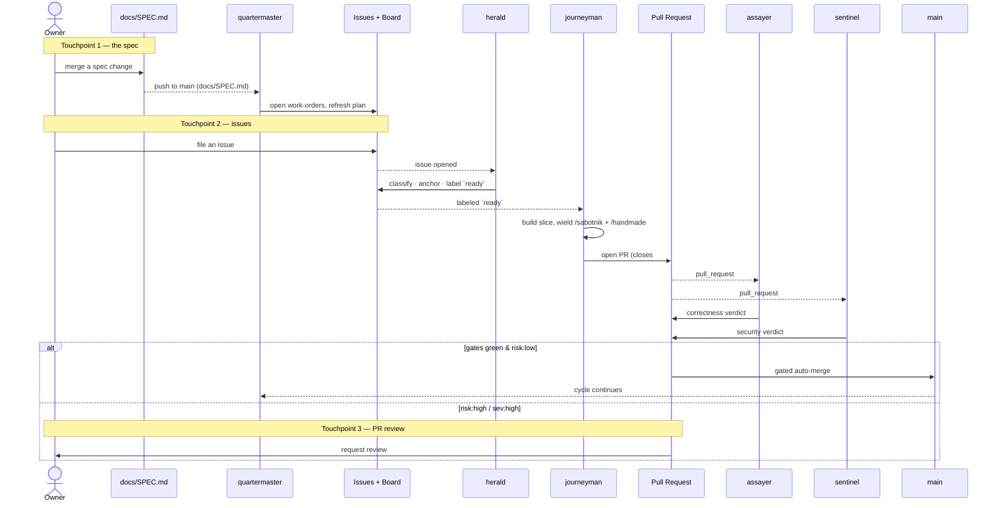

# Agentic Development — Guide

> Guide and overview, **not** the source of truth. The ADW *is* the encoded
> config — `.github/workflows/`, GitHub settings (CODEOWNERS, rulesets, labels,
> the Project board), and `.claude/` (agents, settings, skills). This doc
> explains and ties those together; when the doc and the config disagree, **the
> config wins** and the doc is corrected — never the reverse, because the config
> is what actually runs. `docs/SPEC.md` stays canonical for what Smith *is*;
> agent conduct and merge policy deliberately live here and in
> PROJECT-INVARIANTS §5, not in the spec.

## Vision

The human has exactly **three input points**; agents own everything between them
and leave a reviewed GitHub trail the human can inspect, step into, and steer.

| # | Human input | Frequency | Enforced by |
|---|-------------|-----------|-------------|
| 1 | **The spec** (`docs/SPEC.md`) — mission-critical definition | primary | CODEOWNERS + branch protection (required owner review) |
| 2 | **Issues** — small tasks, bugs | regular | agents consume; humans need never triage |
| 3 | **PR review** — emergencies / high-risk only | rare | required only on `risk:high` or security escalation or protected paths |

Everything else — trigger, triage, implement, review, security-review, merge,
track — is autonomous.

## Encoding surface — where the ADW actually lives

This doc is the map; these are the territory. Each concept resolves to a
concrete artifact that *executes*; the doc only narrates them. "In repo?" flags
what is version-controlled and reviewable via PR versus what lives in GitHub's
API/UI (a drift risk to minimize by preferring the as-code option).

| Concept | Encoded in | In repo? | Authority |
|---|---|---|---|
| agent persona / model / tool scope | `.claude/agents/<role>.md` | ✅ | the file |
| which agent runs on which event | `.github/workflows/<role>.yml` | ✅ | the workflow |
| shared rules all agents inherit | `CLAUDE.md` (+ nested) | ✅ | the file |
| Claude runtime settings | `.claude/settings.json` | ✅ | the file |
| reusable role workflows | `.claude/skills/<name>/SKILL.md` | ✅ | the file |
| integrity floor (never fake green) | `PROJECT-INVARIANTS.md §5`, enforced by CI | ✅ | invariant |
| spec-review requirement | `CODEOWNERS` + a branch **ruleset** | ✅ CODEOWNERS; ⚠️ ruleset exportable as JSON | ruleset |
| merge gates / auto-merge | branch ruleset + workflow gate logic | ⚠️ partial | ruleset + workflow |
| routing labels | `.github/labels.yml` + a label-sync action | ✅ if adopted as-code | `labels.yml` |
| waves | Milestones | ❌ GitHub API/UI | GitHub |
| lifecycle board | Project (v2) | ❌ mostly (scriptable via `gh`) | GitHub |
| bot identity | GitHub App + secrets | ⚠️ App-manifest JSON can live in repo; key/install manual | GitHub |

**Rule:** prefer the as-code option for anything that can be one (rulesets,
labels-as-code, the App manifest) so the ADW is reviewable and reproducible;
accept that the Project board, milestones, and the App installation are
irreducibly GitHub-side. A `xtask adw` (or CI) check can assert the in-repo
artifacts agree with this doc's tables — the same no-drift discipline as the
arch gate.

## The roster — trigger · mission · artifact

Agents are named in the register of the craft skills (`smith`, `pioneer`,
`handmade`, `sabotnik`): one evocable codename each, defined in
`.claude/agents/<name>.md`. Four questions pin every one down — what wakes it,
what it is for, and what single artifact it touches. The craft skills are *verbs
the agents wield*, not agents themselves.

| Agent | Trigger | Mission (one line) | Artifact it owns | Model |
|-------|---------|--------------------|------------------|-------|
| `herald` | issue opened/reopened | triage a raw issue into a labeled, routed, spec-anchored work-order | the **Issue** + board card | Haiku |
| `quartermaster` | spec change lands on `main` | turn the spec diff into tracked work-orders and refresh the plan | **Issues** + `docs/plans/*` | Opus |
| `journeyman` | issue labeled `ready` | build one slice per `WALKING-SKELETON`, hardened, tested | a **branch + PR** (`*/src`, `*/tests`) | Sonnet |
| `assayer` | `pull_request` | adversarially review for correctness vs the spec — a *second* model | a **PR review** | Opus |
| `sentinel` | `pull_request` on sensitive surface / `needs:security` | security review; escalate high severity to the owner | a **PR review** + `risk:*` | Opus |
| `gardener` | `schedule` | unstick stalls, enforce WIP, brake runaways | **Issues/PRs/board** labels | Haiku |
| `pioneer` (skill) | `needs:prototype` | prove/disprove an unproven spec claim with a disposable prototype | `prototypes/*` | Sonnet |

The **authority** for each model and tool scope is the agent's frontmatter — the
`.claude/agents/` directory is the one place to review and change them; a
prospective `xtask agents` renders this table from it. Skills the agents wield:
`journeyman` and `assayer` run `/sabotnik` (de-slop Rust) and `/handmade`
(compress duplication); `pioneer` and `smith` stay owner/skill-invoked, since the
spec is touchpoint 1.

Model tiering: mechanical work (herald) on Haiku; building on Sonnet; everything
adversarial or judgment-heavy (assayer, sentinel, quartermaster) on Opus — and
`assayer` is deliberately a *different* model from `journeyman` so review is a
second opinion, not self-congratulation.

## How the cycle pushes Smith forward

The state of Smith advances spec → issue → branch → review → trunk, with the
human present only at the three touchpoints. Auto-merge is gated (integrity
floor: PROJECT-INVARIANTS §5; merge policy: this plan — see **Open decisions**).

`gardener` runs across this on a schedule — outside any single event — sweeping
for stalls and braking runaways.

## Control surfaces — agents vs output styles vs CLAUDE.md

Deliberately **not** stacked; each does one job:

- **`.claude/agents/*.md`** — the per-role control surface. Carries name,
  description, **model**, **tool scope**, and the persona system prompt in one
  file. This is where a role's identity lives.
- **`CLAUDE.md`** — shared project rules every agent inherits (commit voice,
  spec-before-code). Context, not persona.
- **Output styles** — session-global, main-thread only; they **cannot set model
  or tools and do not reach subagents**. So they are the *wrong* tool for
  per-role control. Recommendation: **do not combine them per role.** At most,
  one house-wide output style could enforce global tone; role behavior stays in
  the agent files.

Net: agents = who/which-model/what-tools; CLAUDE.md = shared rules; output style
= optional global voice. Keeping them in separate layers gives more control than
stacking, with less confusion about what wins.

## GitHub feature mapping (the reviewed trail)

| Concern | Feature |
|---|---|
| unit of work | **Issues** (+ sub-issues for decomposition) |
| lifecycle state | **Project (v2)** board: Triage → Ready → In Progress → In Review → Security → Done; fields for risk / wave / agent-owner |
| routing & gates | **Labels**: `ready`, `risk:high`, `needs:security`, `agent:*` |
| grouping | **Milestones** = waves (`WALKING-SKELETON`, then `TASK-BREAKDOWN` waves) |
| every change | **PRs**, linked to issues (`closes #N`), agent-reviewed |
| spec protection | **CODEOWNERS** + branch protection on `docs/SPEC.md`, `PROJECT-INVARIANTS.md` |
| compute | **Actions** workflows (the triggers) |
| optional | **Discussions** for design deliberation; **Wiki** for generated docs |

Projects v2, Discussions, and Wiki are not reachable from the MCP toolset but
are reachable from `gh` / `gh api graphql` inside Actions — so the agents (which
run in Actions) can drive them.

## Identity — the keystone

A **`smith-bot` GitHub App** is required, not optional, for two reasons:

1. **Cascade.** Actions taken with the default `GITHUB_TOKEN` do **not** trigger
   downstream workflows — an agent-opened PR would never trip the review
   workflow. An App installation token cascades, so the chain actually flows.
2. **Projects scope.** Projects v2 is org/user-scoped; `GITHUB_TOKEN` can't
   write it. The App can be granted project permission.

Bonus: every autonomous action is attributable to the bot, not the human — a
clean audit identity.

### TL;DR — creating the App

1. **Settings → Developer settings → GitHub Apps → New GitHub App** (org-level if
   the Project is org-owned).
2. **Permissions:** Contents RW, Issues RW, Pull requests RW, Checks R, Actions
   R; Organization **Projects RW** (and repo Projects if used); Discussions RW
   and Metadata R as needed.
3. **Install** the App on the `smith` repo.
4. **Generate a private key**; store `APP_ID` + `PRIVATE_KEY` as repo/org
   secrets.
5. In each workflow, mint an installation token with
   `actions/create-github-app-token@v1` and pass it as the action's
   `github_token` (and to `gh` via `GH_TOKEN`). That token both cascades and
   carries Projects scope.

## Guardrails

- **Cost / runaway** — per-run `--max-turns`, concurrency caps, and the
  `gardener` as circuit-breaker; token budgets.
- **Self-review blind spots** — reviewer on a different model than the
  implementer; security-reviewer never auto-approves high severity — it
  escalates to touchpoint #3.
- **Merge safety** — branch protection is the backstop; the integrity rules in
  PROJECT-INVARIANTS §5 bind every agent absolutely: never fake a green run,
  never delete/skip tests, never merge on a red gate. Those are the floor this
  policy sits on.
- **Spec decomposition quality** — the human still owns the spec; the decomposer
  only *proposes* issues. A soft `approved` label can gate the implementer until
  trust is established.

## Open decisions (owner / spec)

1. **Auto-merge gates.** Agent governance now lives outside the spec (the §17.10
   rules moved to PROJECT-INVARIANTS §5 as the integrity floor), so this is no
   longer a spec conflict — it is a policy call owned here. Decide the exact
   gate: CI green + independent review approved + security clear + risk below
   which threshold? Nothing auto-merges until this row is filled in.
2. **Create the `smith-bot` App** (only the owner can).
3. **Risk threshold** for what forces human review (touchpoint #3).

## Phased rollout

- **Phase 0** — CODEOWNERS + branch protection on the spec (enforces touchpoint
  #1); create the Project board; land the `.claude/agents/*` personas. No
  autonomy yet.
- **Phase 1** — `issues → triager → implementer → PR` on the existing proven CI;
  **human reviews every PR** (build trust in the trail).
- **Phase 2** — add `reviewer` + `security-reviewer`; enable gated auto-merge for
  `risk:low` only (requires decision #1).
- **Phase 3** — add `spec-decomposer` + `gardener`; full autonomy with the human
  at the three touchpoints.

Each phase is independently useful and reversible.
